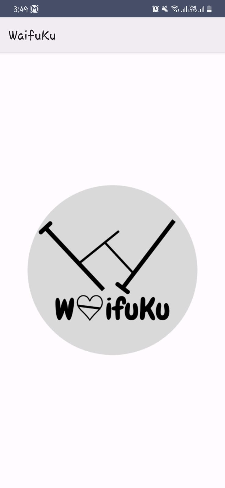
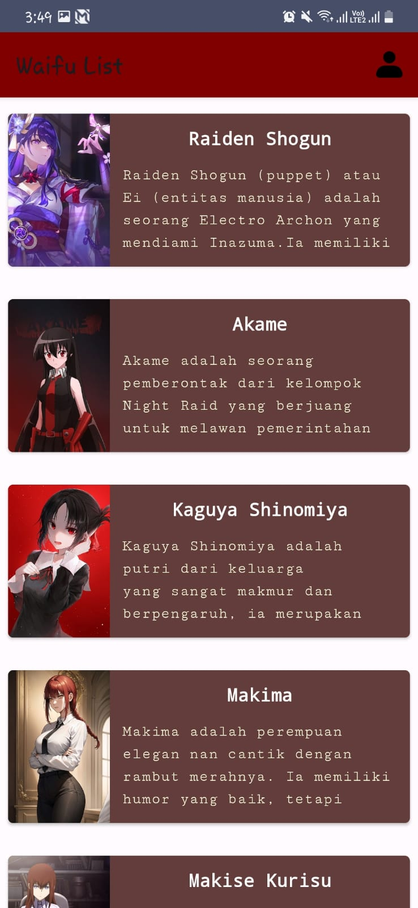
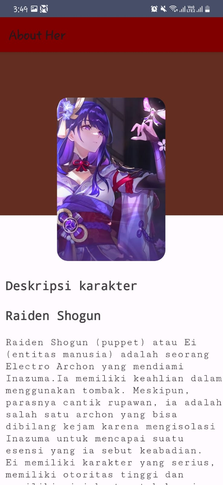

# WaifuKu
Dicoding Android Beginner : I create simple android application that implementing recycler view and animation. 
# Appendix
- Splash Screen
  
- Home Screen
I am implementing recycler view to show the data as a list in application.
  
- Detail Page
To bring the data like image and description from home screen I use parcelize so that I can show it as well in the detail screen.
  
- Profile Page

